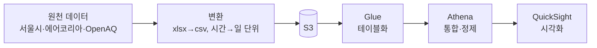

# 실외 공기질 분석 플랫폼 (air-sensor)

베스핀글로벌 아카데미 클라우드 데이터 엔지니어 양성과정(새싹 강동캠퍼스, 2024.09–2025.01) 최종 프로젝트. 서울시·에어코리아 대기질을 **측정소(로케이션) 기준으로 통합**하고, AWS에서 저장·분석·시각화까지 연결한 팀 프로젝트입니다. 이 저장소는 설계·검증 기록과 제 담당 범위를 정리한 것입니다.

> [!IMPORTANT]
> 파이프라인 실행 스크립트(Glue·Lambda·Athena 쿼리)는 교육 과정에서 제공된 AWS 계정에서 실행되어 이 저장소에 호스팅되지 않습니다. 아래는 실제 구현·검증한 설계와 결과물(최종 보고서·대시보드)이며, 스크립트 구성은 발표 자료 기준으로 설명할 수 있습니다.

## 아키텍처

### 배치 파이프라인 (핵심)

### 실시간 파이프라인 (확장 실험)

## 제 담당 범위

- **에어코리아 데이터 처리** — 전량 xlsx→csv 변환 후 S3 적재, 2023년 시간 단위 데이터를 일 단위로 재가공해 출처 간 비교 가능 형태로 통일
- **출처 간 스키마·지역 통합** — `측정일시`/`측정일자` 등 상이한 컬럼명을 `datetime`/`date` 기준으로 통일, `pm10·pm25·so2·no2·co·o3` 공통 지표 매핑, 행정 지역명 불일치는 `location_master` 마스터 테이블 + 매핑 테이블로 해소
- **데이터 품질 검증** — 서울시 vs 에어코리아 결측(0/NULL) 패턴 비교, 극단값·반복값을 "환경 요인 vs 데이터 오류" 관점으로 분리 점검

## 데이터 범위

- 서울시 대기환경 정보: 2019년~ (출처 간 비교 기준 통일)
- 에어코리아 측정자료: 2019–2023

## 시각화 시나리오 (QuickSight)

| 시나리오 | 목적 |
|---|---|
| 요일 × 시간대 히트맵 | 출퇴근 시간대의 오염도 변화 확인 |
| 시간대별 PM10/PM2.5 박스플롯 | 출근·퇴근·기타 구간 분포 비교 |
| 측정소 좌표 지도 | 농도·등급을 크기/색으로 지역 비교 |
| 상관행렬·산점도 | IAQ(통합대기환경지수)와 오염물질 간 관계 |
| 계절별 추이 | PM10/PM2.5/O₃ 계절 패턴 |

## 산출물

- [최종 보고서 — 실시간 공기질 대시보드 (PDF)](https://github.com/user-attachments/files/18530271/-.-.pdf)
- [QuickSight 대시보드 스크린샷 — 전체·시간대별 평균 (PDF)](https://github.com/user-attachments/files/18530320/quicksight-.-._._._2025-01-24T02_34_15.pdf)
- [QuickSight 대시보드 스크린샷 — 오늘 하루 평균 (PDF)](https://github.com/user-attachments/files/18530319/quicksight-.-._._._2025-01-24T02_33_57.pdf)
- [QuickSight 대시보드 스크린샷 — 최신 (PDF)](https://github.com/user-attachments/files/18530318/quicksight-.-._2025-01-24T02_34_40.pdf)

